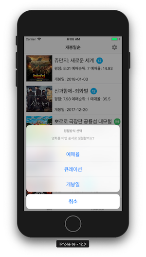
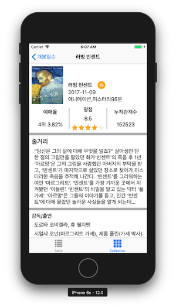
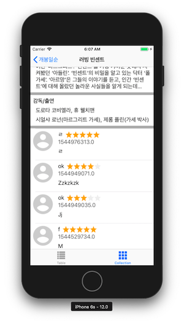

# BoostCamp
Box office 

## 요구사항
- 서버에 요청하는 과정 url session 활용  
- 이미지 다운: DispatchQueue global  
- 이미지 표시: DispatchQueue main  

## 선택요구사항
- 네트워크 동작중 인디케이터를 표시  
- 데이터 수신을 못하고 실패한 경우 사용자에게 알림  

```
showToast(message : String)
toastLabel 생성 후 2초 동안 알림 -> superview로 부터 제거
```

## 📸 




